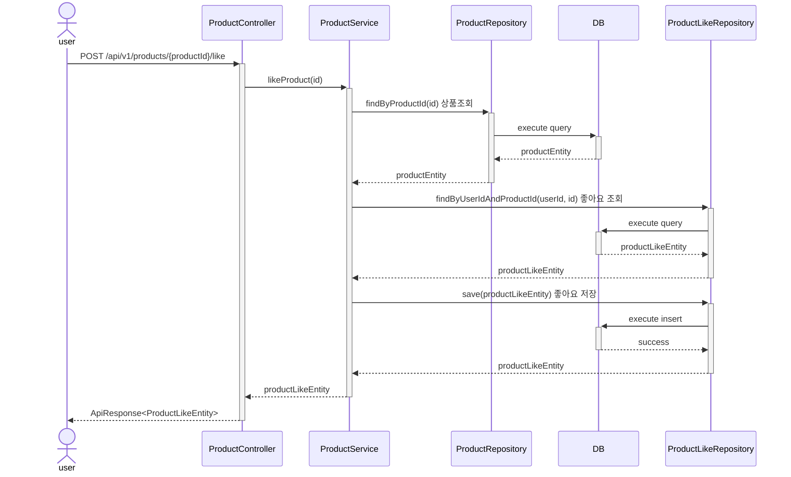
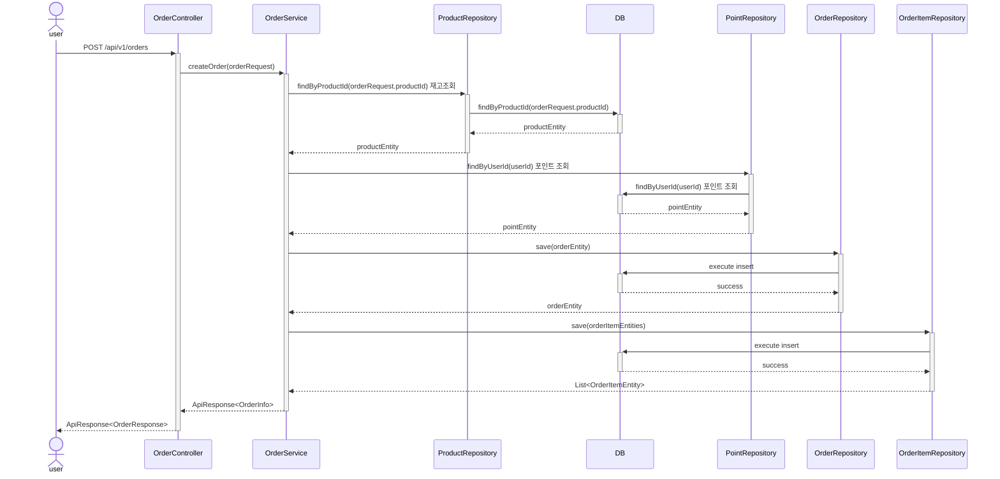
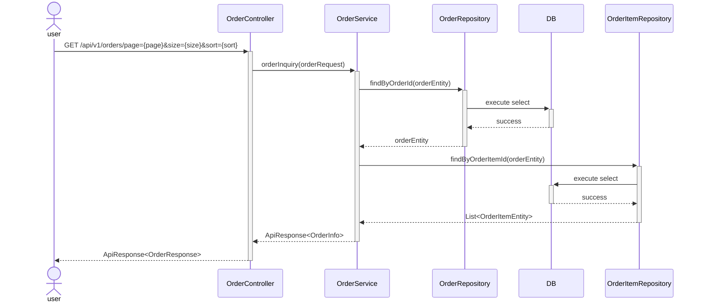
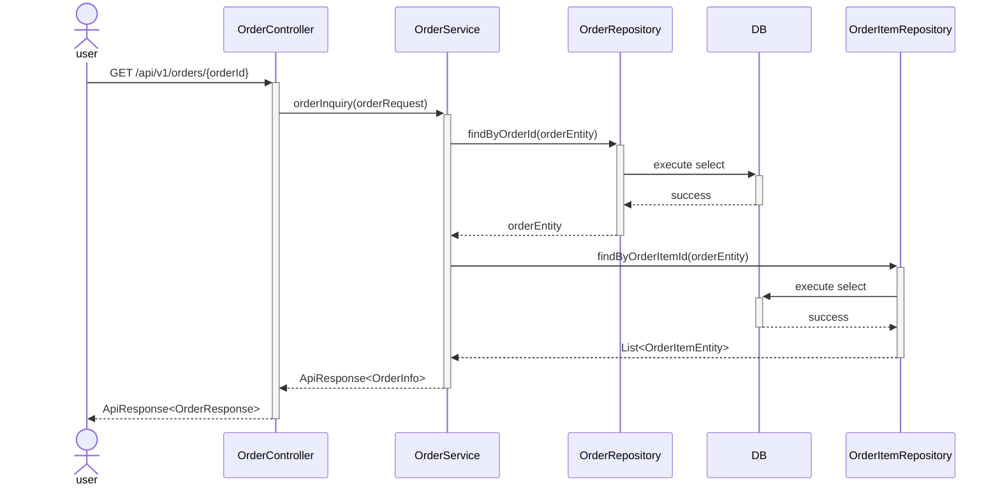

### 상품 목록 조회
#### 기능 요구사항
- 상품리스트
- 페이징
- 좋아요
- 브랜드 필터
- 최근 등록순
- 가격 정렬
- 주문수 정렬
- 좋아요 정렬

```mermaid
sequenceDiagram
  participant user
  participant ProductController
  participant ProductService
  participant ProductRepository
  participant ProductLikeRepository
  participant OrderRepository
  participant DB
  actor user
  user->>+ProductController : GET /api/v1/products/brand={brand}&page={page}&size={size}&sort={sort}
  ProductController->>+ProductService : getProductsList()
  
  ProductService->>+ProductRepository : query products
  ProductRepository->>+DB : execute query
  DB-->>-ProductRepository : return List<productEntity>
  ProductRepository-->>-ProductService : List<productEntity>

  ProductService->>+ProductLikeRepository : findByUserId(userId) 좋아요 조회
  ProductLikeRepository->>+DB : findByUserId(userId)
  DB-->>-ProductLikeRepository : List<productLikeEntity>
  ProductLikeRepository-->>-ProductService : List<productLikeEntity>

  ProductService->>+BrandRepository : findByBrandId(brandId) 브랜드 조회
  BrandRepository->>+DB : findByBrandId(productId)
  DB-->>-BrandRepository : List<BrandEntity>
  BrandRepository-->>-ProductService : List<BrandEntity>

  ProductService->>+OrderRepository : findByProductId(productId) 주문 수 조회
  OrderRepository->>+DB : findByProductId(productId)
  DB-->>-OrderRepository : List<orderEntity>
  OrderRepository-->>-ProductService : List<orderEntity>

  ProductService-->>-ProductController : List<ProductInfo>
  ProductController-->>-user : ApiResponse<List<ProductInfo>>
  ```

---

### 상품상세
#### 기능 요구사항
- 선택 제품의 상세정보 노출
- 좋아요 카운팅
- 좋아요 기능
- 주문수


``` mermaid
sequenceDiagram
actor user
user->>+ProductController : GET /api/v1/products/{productId}
ProductController->>+ProductService : getProductById(productId)
ProductService->>+ProductRepository : findByProductId(productId)
ProductRepository->>+DB : execute query
DB->>-ProductRepository : productEntity

ProductService->>+ProductLikeRepository : findByProductId(productId) 좋아요 조회
ProductLikeRepository->>+DB : findByProductId(productId)
DB-->>-ProductLikeRepository : productLikeEntity

ProductLikeRepository-->>-ProductService : productLike
ProductRepository-->>-ProductService : productEntity

ProductService->>+OrderRepository : findByProductId(productId) 주문 수 조회
OrderRepository->>+DB : findByProductId(productId)
DB-->>-OrderRepository : List<orderEntity>
OrderRepository-->>-ProductService : List<orderEntity>
  
ProductService-->>-ProductController : productInfo
ProductController-->>-user : ApiResponse<ProductInfo>
```
---

### 브랜드 조회
#### 기능 요구사항
- 브랜드 필터로 상품조회
- 좋아요 카운팅
- 주문량 정렬

  ```mermaid
  sequenceDiagram
  actor user
  user->>+BrandController : GET /api/v1/brands/{brandcode}/page={page}&size={size}&sort={sort}
  BrandController->>+BrandService : getBrandsByBrandCode(brandCode, page, size, sort)
  BrandService->>+BrandRepository : findByBrandCode(brandCode, page, size, sort)
  BrandRepository->>+DB : execute query
  DB-->>-BrandRepository : List<brandEntity>
  BrandRepository-->>-BrandService : List<brandEntity>
  
  ProductService->>+OrderRepository : findByProductId(productId) 주문 수 조회
  OrderRepository->>+DB : findByProductId(productId)
  DB-->>-OrderRepository : List<orderEntity>
  OrderRepository-->>-ProductService : List<orderEntity>
  
  BrandService-->>-BrandController : List<BrandInfo>
  BrandController-->>-user : ApiResponse<List<BrandInfo>>
  ```
---

### 상품 좋아요
#### 기능 요구사항
- 본인것만 핸들링 되어야 함(X-USER-ID 헤더 검증)
- 상품 좋아요 등록/취소
- 좋아요, 취소는 상품당 단 1번만 가능



---

### 주문생성
#### 기능 요구사항
- 본인만 되어야 함(X-USER-ID 헤더 검증)
- 주문 생성 및 결제 흐름 (재고 차감, 포인트 차감, 외부 시스템 연동)
- 재고 확인 후 실결제 프로세스
- 포인트금액이 구매물품보다 커야 함
- 추후 쿠폰 기능 추가 예정



### 주문 리스트 조회
#### 기능 요구사항
- 본인것만 조회되어야 함(X-USER-ID 헤더 검증)
- 페이징
- 최근순 정렬




### 주문 상세 조회
#### 기능 요구사항
- 본인것만 조회되어야 함(X-USER-ID 헤더 검증)

