## 📌상품 목록 조회
- 상품리스트
- 페이징
- 좋아요
- 브랜드 필터 가능여부 옵셔널
- 최근 등록순 가능여부 옵셔널
- 가격 정렬 가능여부 옵셔널
- 주문수 정렬 가능여부 옵셔널
- 좋아요 정렬 가능여부 옵셔널

```mermaid
sequenceDiagram
    actor Client
  participant ProductService as 상품
  participant BrandService as 브랜드
  participant LikeService as 좋아요

  Client->>ProductService: GET /api/v1/products?brand={brand}&page={page}&size={size}&sort={sort}

  alt 상품 존재하지 않음
    ProductService-->>Client: "상품 조회 결과가 없습니다"
  else 상품 존재함
    ProductService->>BrandService: 브랜드 정보 조회

    alt 브랜드 존재하지 않음
      BrandService-->>ProductService: 브랜드 없음
      ProductService-->>Client: "조회한 상품의 브랜드 조회 결과가 없습니다"
    else 브랜드 존재함
      BrandService-->>ProductService: 브랜드 정보 반환
      ProductService->>LikeService: 좋아요 정보 조회
      LikeService-->>ProductService: 좋아요 정보 반환
      ProductService-->>Client: 상품 + 브랜드 + 좋아요 정보 응답
    end
  end
  ```

---

## 📌상품상세
- 선택 제품의 상세정보 노출
- 브랜드 소개도 포함
- 좋아요 카운팅
- 좋아요 기능


``` mermaid
sequenceDiagram
    actor Client
    participant ProductService as 상품
    participant BrandService as 브랜드
    participant LikeService as 좋아요

    Client->>ProductService: GET /api/v1/products/{productId}

    alt 상품 존재하지 않음
        ProductService-->>Client: "상품을 찾을 수 없습니다"
    else 상품 존재함
        ProductService->>BrandService: 브랜드 정보 조회
        alt 브랜드 없음
            BrandService-->>ProductService: 브랜드 정보 없음
            ProductService-->>Client: "브랜드 정보를 찾을 수 없습니다"
        else 브랜드 있음
            BrandService-->>ProductService: 브랜드 정보 반환
            ProductService->>LikeService: 좋아요 조회
            LikeService-->>ProductService: 좋아요 상태 반환
            ProductService-->>Client: 상품 상세 + 브랜드 + 좋아요 상태 응답
        end
    end
```
---

## 📌브랜드 조회
- 브랜드 필터로 상품조회
- 좋아요 카운팅
- 주문량 정렬

```mermaid
sequenceDiagram
  actor user
  participant BrandService as 브랜드
  participant ProductService as 상품
  participant LikeService as 좋아요

  user->>+BrandService: GET /api/v1/brands/{brandCode}?page={page}&size={size}&sort={sort}


  alt 브랜드 존재하지 않음
    BrandService-->>user: "조회하려는 브랜드가 존재하지 않습니다"
  else 브랜드 존재함
    BrandService->>ProductService: 상품 조회

    alt 상품 없음
      ProductService-->>BrandService: 빈 목록
      BrandService-->>user: "브랜드에서 판매 중인 상품이 없습니다"
    else 상품 있음
      ProductService-->>BrandService: 상품 목록 반환
      BrandService->>LikeService: 상품 좋아요 조회
      LikeService-->>BrandService: 좋아요 정보 반환
      BrandService-->>user: 상품 + 좋아요 정보 응답
    end
  end
```


---

## 📌상품 좋아요
- 본인것만 핸들링 되어야 함(X-USER-ID 헤더 검증)
- 상품 좋아요 등록
- 좋아요, 취소는 상품당 단 1번만 가능

```mermaid
sequenceDiagram
    actor user
  participant AuthService as 회원 여부인증
  participant ProductService as 상품 서비스
  participant LikeService as 좋아요 서비스

  user->>+AuthService: 좋아요 요청
  alt 비회원
    AuthService-->>user: "회원만 이용 가능한 기능입니다"
  else 회원
    AuthService-->>ProductService: 상품 조회
    alt 상품 없음
      ProductService-->>AuthService: "상품이 존재하지 않습니다"
      AuthService-->>user: "상품이 존재하지 않습니다"
    else 상품 존재
      ProductService-->>AuthService: 상품 정보 반환
      AuthService->>LikeService: 좋아요 수 

      alt 이미 좋아요 등록됨
        LikeService-->>AuthService: 좋아요 유지 (멱등 처리)
      else 최초 좋아요
        LikeService-->>AuthService: 좋아요 수 증가
      end

      AuthService-->>user: 좋아요 처리 완료
    end
  end
```



## 📌상품 좋아요 취소
- 본인것만 핸들링 되어야 함(X-USER-ID 헤더 검증)
- 상품 좋아요 등록
- 좋아요 상품당 단 1번만 가능

```mermaid
sequenceDiagram
    actor user
    participant AuthService as 인증 서비스
    participant ProductService as 상품 서비스
    participant LikeService as 좋아요 서비스

    user->>+AuthService: 좋아요 취소 요청

    alt 비회원
        AuthService-->>user: "회원만 이용 가능한 기능입니다"
    else 회원
        AuthService-->>ProductService: 상품 조회
        alt 상품 없음
            ProductService-->>AuthService: "상품이 존재하지 않습니다"
            AuthService-->>user: "상품이 존재하지 않습니다"
        else 상품 존재
            ProductService-->>AuthService: 상품 정보 반환
            AuthService->>LikeService: 좋아요 취소

            alt 좋아요 미등록 상태
                LikeService-->>AuthService: 좋아요 없음 (멱등 처리)
            else 좋아요 등록 상태
                LikeService-->>AuthService: 좋아요 수 감소 및 좋아요 제거
            end

            AuthService-->>user: 좋아요 취소 처리 완료
        end
    end

```


---

## 📌주문생성
- 본인만 되어야 함(X-USER-ID 헤더 검증)
- 주문 생성 및 결제 흐름 (재고 차감, 포인트 차감, 외부 시스템 연동)
- 재고 확인 후 실결제 프로세스
- 포인트금액이 구매물품보다 커야 함

```mermaid
sequenceDiagram
    actor user
    participant OrderService as 주문
    participant AuthService as 인증
    participant ProductService as 상품
    participant PointService as 포인트
    participant PaymentGateway as 외부

    user->>+OrderService: POST /api/v1/orders

    OrderService->>AuthService: 헤더값 (X-USER-ID) 검증

    alt 비회원 또는 사용자 불일치
        AuthService-->>OrderService: invalid
        OrderService-->>user: "본인만 주문 가능합니다"
    else 회원 확인 완료
        AuthService-->>OrderService: 인가된 요청확인
        OrderService->>ProductService: 재고 여부 확인

        alt 재고 부족
            ProductService-->>OrderService: 재고 여부 확인
            OrderService-->>user: "재고가 부족합니다"
        else 재고 충분
            ProductService-->>OrderService: OK
            OrderService->>PointService: 소유한 포인트 확인

            alt 포인트 부족
                PointService-->>OrderService: 포인트 확인
                OrderService-->>user: "포인트가 부족합니다"
            else 포인트 충분
                OrderService->>PointService: 포인트 사용처리
                OrderService->>PaymentGateway: 결제요청
                PaymentGateway-->>OrderService: 결제 완료

                alt 결제 성공
                    OrderService-->>user: 주문 완료 + 결제 성공
                else 결제 실패
                    OrderService-->>user: 결제 실패 안내
                end
            end
        end
    end
```



---
## 📌주문 리스트 조회
- 본인것만 조회되어야 함(X-USER-ID 헤더 검증)
- 페이징
- 최근순 정렬
- 조회일자

```mermaid
sequenceDiagram
    actor user
    participant AuthService as 인증
    participant OrderService as 주문
    user->>+AuthService : GET /api/v1/orders/page={page}&size={size}&sort={sort}&fromDate={fromDate}&toDate={toDate}
    alt 인증 실패
        AuthService-->>user: "본인만 조회할 수 있습니다"
    else 인증 성공
        AuthService-->>OrderService: 주문내역 리스트 조회
        alt 주문 내역 없음
            OrderService-->>user: "주문 내역이 없습니다"
        else 주문 내역 존재
            OrderService-->>user: 주문 목록 반환
        end
    end
```



---
## 📌주문 상세 조회
- 본인이 주문한것만 조회되어야 함(X-USER-ID 헤더 검증)

```mermaid
sequenceDiagram
    actor user
    participant AuthService as 인증
    participant OrderService as 주문
  user->>+AuthService : GET /api/v1/orders/{orderId}
    alt 인증 실패
        AuthService-->>user: "본인만 조회할 수 있습니다"
    else 인증 성공
        AuthService-->>OrderService: 주문상세
        alt 주문 내역 없음
            OrderService-->>user: "주문 내역이 없습니다"
        else 주문 내역 존재
            OrderService-->>user: 주문 목록 반환
        end
    end
```


---
## 📌주문 상품에 대해 리뷰 남기기
- 본인이 주문한 주문번호에 대해 구매확정한 상태에서 작성가능

```mermaid
sequenceDiagram
    actor user
    participant AuthService as 인증
    participant OrderService as 주문
    participant ReviewService as 리뷰

    user->>+AuthService: X-USER-ID 헤더 인증 요청

    alt 인증 실패
        AuthService-->>user: "회원만 이용 가능한 기능입니다"
    else 인증 성공
        AuthService-->>OrderService: 주문 내역 조회
        alt 주문 내역에 없음
            OrderService-->>user: "구매한 상품에 대해서만 리뷰를 작성할 수 있습니다"
        else 주문 확인됨
            OrderService-->>ReviewService: 리뷰 작성

            alt 이미 리뷰 작성됨
                ReviewService-->>user: "이미 리뷰를 작성하셨습니다"
            else 리뷰 가능
                ReviewService-->>user: "리뷰가 등록되었습니다"
            end
        end
    end
```


---
### 📌리뷰 확인
- 상품에 리뷰가 없을때는 빈 리스트 반환

```mermaid
sequenceDiagram
    actor user
    participant ProductService as 상품
    participant ReviewService as 리뷰

    user->>+ProductService: 상품 리뷰 조회
    ProductService->>+ReviewService: 상품에 대한 리뷰 화인

    alt 리뷰 존재
        ReviewService-->>ProductService: 상품 리뷰 리스트 반환
        ProductService-->>user: 상품 상세 + 리뷰 리스트
    else 리뷰 없음
        ReviewService-->>ProductService: 빈 리스트 반환
        ProductService-->>user: 상품 상세 + "리뷰가 없습니다"
    end
```

