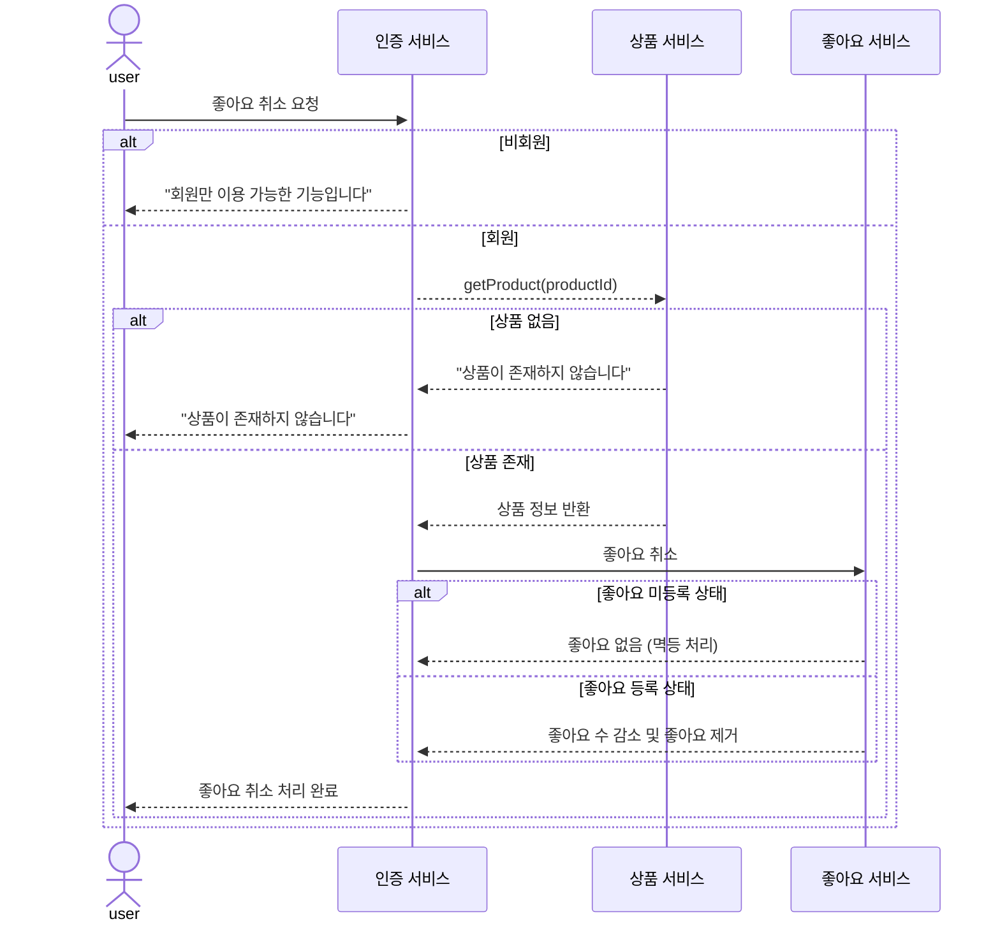
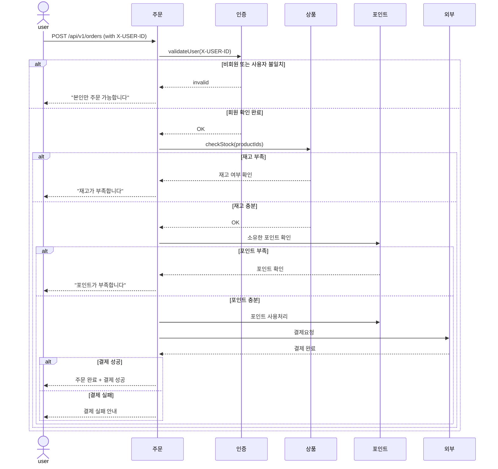

### 상품 목록 조회
#### 기능 요구사항
- 상품리스트
- 페이징
- 좋아요
- 브랜드 필터
- 최근 등록순
- 가격 정렬
- 주문수 정렬
- 좋아요 정렬

```mermaid
sequenceDiagram
    actor Client
  participant ProductService as 상품
  participant BrandService as 브랜드
  participant LikeService as 좋아요

  Client->>ProductService: GET /api/v1/products?brand={brand}&page={page}&size={size}&sort={sort}

  alt 상품 존재하지 않음
    ProductService-->>Client: "상품 조회 결과가 없습니다"
  else 상품 존재함
    ProductService->>BrandService: 브랜드 정보 조회

    alt 브랜드 존재하지 않음
      BrandService-->>ProductService: 브랜드 없음
      ProductService-->>Client: "조회한 상품의 브랜드 조회 결과가 없습니다"
    else 브랜드 존재함
      BrandService-->>ProductService: 브랜드 정보 반환
      ProductService->>LikeService: 좋아요 정보 조회
      LikeService-->>ProductService: 좋아요 정보 반환
      ProductService-->>Client: 상품 + 브랜드 + 좋아요 정보 응답
    end
  end
  ```

---

### 상품상세
#### 기능 요구사항
- 선택 제품의 상세정보 노출
- 브랜드 소개도 포함
- 좋아요 카운팅
- 좋아요 기능


``` mermaid
sequenceDiagram
    actor Client
    participant ProductService as 상품
    participant BrandService as 브랜드
    participant LikeService as 좋아요

    Client->>ProductService: GET /api/v1/products/{productId}

    alt 상품 존재하지 않음
        ProductService-->>Client: "상품을 찾을 수 없습니다"
    else 상품 존재함
        ProductService->>BrandService: 브랜드 정보 조회 (product.brandId)

        alt 브랜드 없음
            BrandService-->>ProductService: 브랜드 정보 없음
            ProductService-->>Client: "브랜드 정보를 찾을 수 없습니다"
        else 브랜드 있음
            BrandService-->>ProductService: 브랜드 정보 반환
            ProductService->>LikeService: 좋아요 조회
            LikeService-->>ProductService: 좋아요 상태 반환
            ProductService-->>Client: 상품 상세 + 브랜드 + 좋아요 상태 응답
        end
    end
```
---

### 브랜드 조회
#### 기능 요구사항
- 브랜드 필터로 상품조회
- 좋아요 카운팅
- 주문량 정렬


---

### 상품 좋아요
#### 기능 요구사항
- 본인것만 핸들링 되어야 함(X-USER-ID 헤더 검증)
- 상품 좋아요 등록
- 좋아요, 취소는 상품당 단 1번만 가능


### 상품 좋아요 취소
- 본인것만 핸들링 되어야 함(X-USER-ID 헤더 검증)
- 상품 좋아요 등록
- 좋아요 상품당 단 1번만 가능


---

### 주문생성
#### 기능 요구사항
- 본인만 되어야 함(X-USER-ID 헤더 검증)
- 주문 생성 및 결제 흐름 (재고 차감, 포인트 차감, 외부 시스템 연동)
- 재고 확인 후 실결제 프로세스
- 포인트금액이 구매물품보다 커야 함



---
### 주문 리스트 조회
#### 기능 요구사항
- 본인것만 조회되어야 함(X-USER-ID 헤더 검증)
- 페이징
- 최근순 정렬
- 조회일자


---
### 주문 상세 조회
#### 기능 요구사항
- 본인이 주문한것만 조회되어야 함(X-USER-ID 헤더 검증)


---
### 주문 상품에 대해 리뷰 남기기
#### 기능 요구사항
- 본인이 주문한 주문번호에 대해 구매확정한 상태에서 작성가능


---
### 리뷰 확인
#### 기능 요구사항
- 상품에 리뷰가 없을때는 빈 리스트 반환

