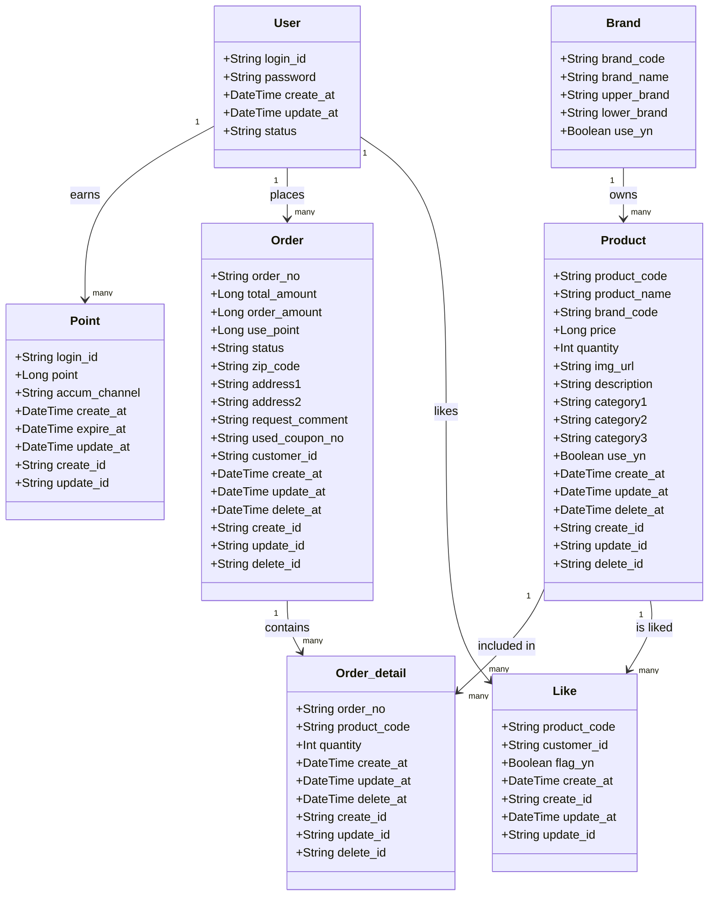

```mermaid
classDiagram

%% User Table
class User {
  +String login_id
  +String password
  +DateTime create_at
  +DateTime update_at
  +String status
}

%% Point Table
class Point {
  +String login_id
  +Long point
  +String accum_channel
  +DateTime create_at
  +DateTime expire_at
  +DateTime update_at
  +String create_id
  +String update_id
}

%% Order Table
class Order {
  +String order_no
  +Long total_amount
  +Long order_amount
  +Long use_point
  +String status
  +String zip_code
  +String address1
  +String address2
  +String request_comment
  +String used_coupon_no
  +String customer_id
  +DateTime create_at
  +DateTime update_at
  +DateTime delete_at
  +String create_id
  +String update_id
  +String delete_id
}

%% Order_detail Table
class Order_detail {
  +String order_no
  +String product_code
  +Int quantity
  +DateTime create_at
  +DateTime update_at
  +DateTime delete_at
  +String create_id
  +String update_id
  +String delete_id
}

%% Product Table
class Product {
  +String product_code
  +String product_name
  +String brand_code
  +Long price
  +Int quantity
  +String img_url
  +String description
  +String category1
  +String category2
  +String category3
  +Boolean use_yn
  +DateTime create_at
  +DateTime update_at
  +DateTime delete_at
  +String create_id
  +String update_id
  +String delete_id
}

%% Brand Table
class Brand {
  +String brand_code
  +String brand_name
  +String upper_brand
  +String lower_brand
  +Boolean use_yn
}

%% Like Table
class Like {
  +String product_code
  +String customer_id
  +Boolean flag_yn
  +DateTime create_at
  +String create_id
  +DateTime update_at
  +String update_id
}

%% Relationships
User "1" --> "many" Point : earns
User "1" --> "many" Order : places
User "1" --> "many" Like : likes
Product "1" --> "many" Order_detail : included in
Product "1" --> "many" Like : is liked
Order "1" --> "many" Order_detail : contains
Brand "1" --> "many" Product : owns
```
