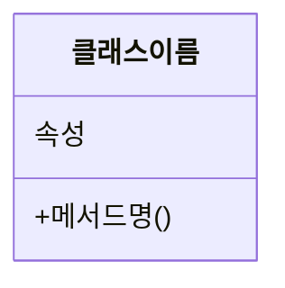
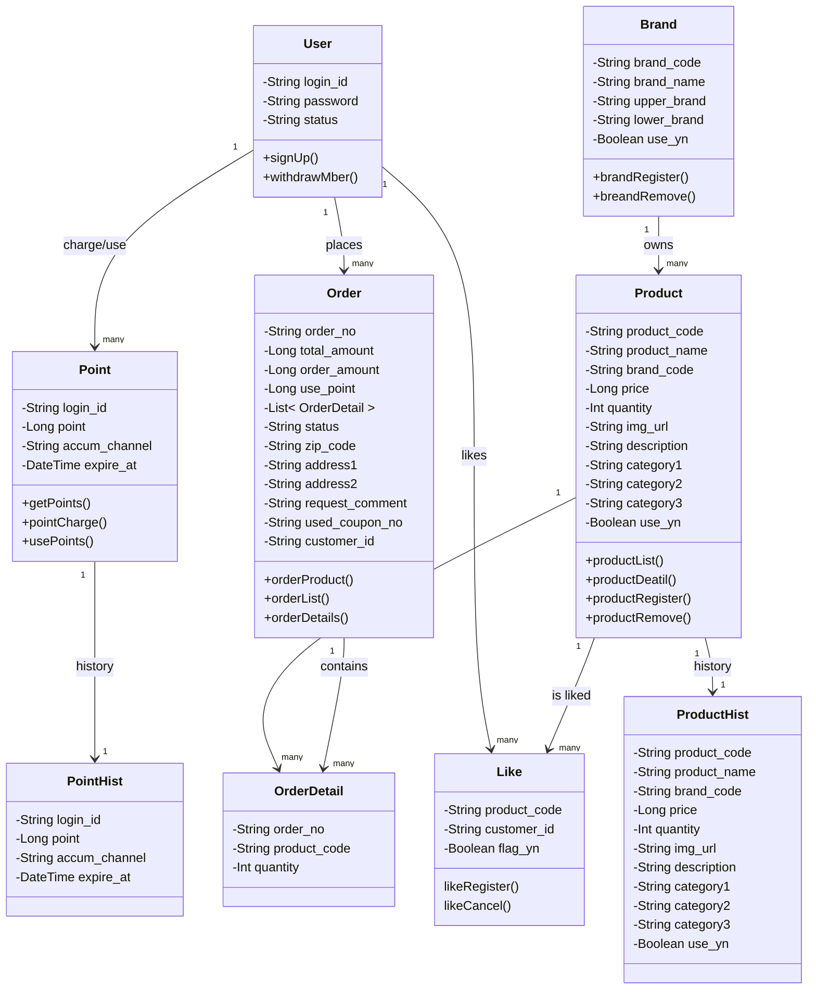

## 📌Class Diagram
> - *클래스간의 관계를 나타내며  상호작용 방식을 도식화 함*
> - User, Point, Brand, Order, Order_detail, Product, Like는 변화관리 추적을 위해 변경, 삭제, 생성을을 관리하는 BaseEntity 상속

## 📌구성요소
### 1. 가시성 (Visibility):
* 클래스 멤버(속성, 메서드)에 대한 접근 수준을 나타내는 기호입니다.
* +: public (공개) - 어디서든 접근 가능
* -: private (비공개) - 해당 클래스 내에서만 접근 가능
* #: protected (보호) - 해당 클래스와 자식 클래스에서 접근 가능
* ~: package / default (패키지) - 동일 패키지 내에서만 접근 가능 (Java의 기본 접근 지정자)
### 2. 관계 (Relationships)
* 표현: 실선 (-----)
* 예: 고객은 주문을 한다. (Customer --- Order)
* 다중성 (Multiplicity/Cardinality): 관계에 참여하는 객체의 수를 나타냅니다. 선의 양 끝에 표기합니다.
* 1: 정확히 하나
* 0..1: 0 또는 하나 (선택적)
* *: 0 또는 그 이상 (다수)
* 1..*: 1 또는 그 이상
* m..n: m개에서 n개 사이

