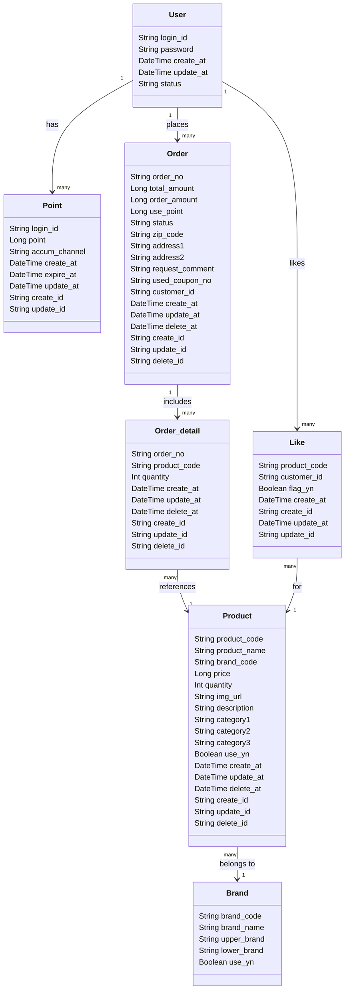

```mermaid
classDiagram

%% User
class User {
  String login_id
  String password
  DateTime create_at
  DateTime update_at
  String status
}

%% Point
class Point {
  String login_id
  Long point
  String accum_channel
  DateTime create_at
  DateTime expire_at
  DateTime update_at
  String create_id
  String update_id
}

%% Order
class Order {
  String order_no
  Long total_amount
  Long order_amount
  Long use_point
  String status
  String zip_code
  String address1
  String address2
  String request_comment
  String used_coupon_no
  String customer_id
  DateTime create_at
  DateTime update_at
  DateTime delete_at
  String create_id
  String update_id
  String delete_id
}

%% Order_detail
class Order_detail {
  String order_no
  String product_code
  Int quantity
  DateTime create_at
  DateTime update_at
  DateTime delete_at
  String create_id
  String update_id
  String delete_id
}

%% Product
class Product {
  String product_code
  String product_name
  String brand_code
  Long price
  Int quantity
  String img_url
  String description
  String category1
  String category2
  String category3
  Boolean use_yn
  DateTime create_at
  DateTime update_at
  DateTime delete_at
  String create_id
  String update_id
  String delete_id
}

%% Like
class Like {
  String product_code
  String customer_id
  Boolean flag_yn
  DateTime create_at
  String create_id
  DateTime update_at
  String update_id
}

%% Brand
class Brand {
  String brand_code
  String brand_name
  String upper_brand
  String lower_brand
  Boolean use_yn
}

%% Associations
User "1" --> "many" Point : has
User "1" --> "many" Order : places
Order "1" --> "many" Order_detail : includes
Order_detail "many" --> "1" Product : references
Product "many" --> "1" Brand : belongs to
User "1" --> "many" Like : likes
Like "many" --> "1" Product : for
```
